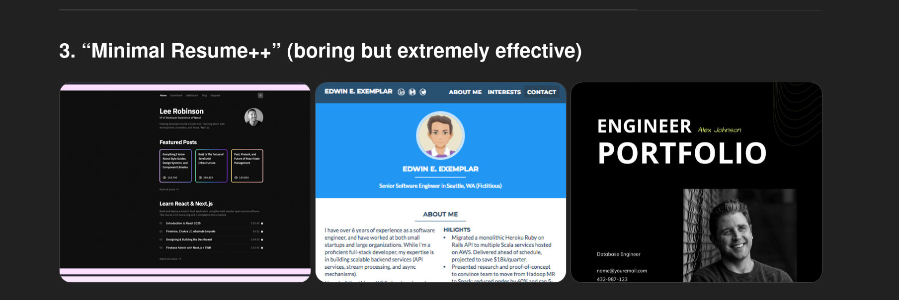
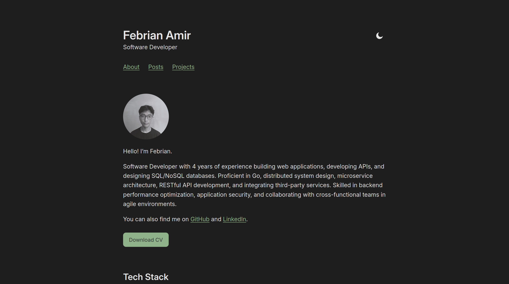
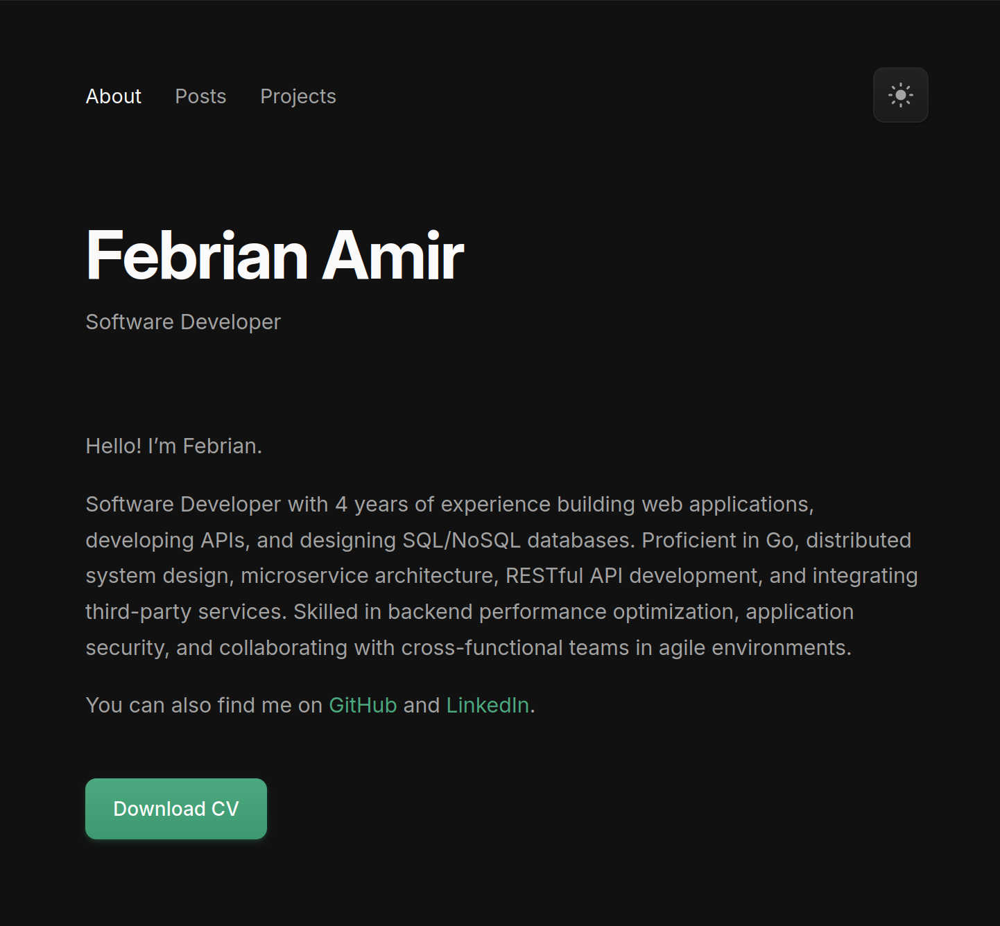

+++
title = 'Revamping my blog design using ChatGPT and AmpCode'
date = 2026-01-31T11:00:00-07:00
draft = false
+++

A couple of days ago, I realized my blog design was kind of off. I don't really know how to explain it (typical backend-heavy person), it just didn’t feel very consistent or proportional, and the colors definitely needed some improvement. So I decided to revamp it using AI, focusing purely on the visual design without significantly changing the layout or the content.

1. First, I used ChatGPT 5.2 to generate multiple blog design inspirations. I ended up with one that was good enough to move forward with (I choose the first image).

2. Then, I created a prompt with my requirements and constraints, and refined it further using ChatGPT (yes, I use AI to make the prompt too). Here’s the refined prompt:

> **Goal:**
> Revamp the website’s visual design to match the **reference image I provided**, while preserving all existing content and structure.
>
> **Design constraints:**
>
> - Use **green as the primary accent color**, but **slightly muted / toned down** (avoid neon or overly bright green)
> - Support both **dark mode and light mode**
> - Use **subtle gradients** for primary buttons and interactive elements
> - Apply **soft, modern box shadows** where appropriate (buttons, cards, sections)
> - Keep the design **consistent across all pages** (typography, spacing, colors, components)
>
> **Styling guidelines:**
>
> - Gradients should be **subtle and tasteful**, not flashy
> - Shadows should enhance depth but remain minimal (no heavy or harsh shadows)
> - Maintain good contrast and accessibility in both dark and light modes
>
> **Content rules (strict):**
>
> - **Do NOT add, remove, or modify any content**
> - Use **only the existing content and data**
> - No placeholder text, no new sections, no rewritten copy
>
> **Technical scope:**
>
> - The main code to modify is inside:
>   - `themes/febrianamir/`
>   - CSS and JS are located in `assets/`
>   - Templates and layout changes are in `layouts/`
> - Do **not** introduce new frameworks or external dependencies unless absolutely necessary
> - Keep changes minimal and scoped to styling and layout only
>
> **Output expectations:**
>
> - Update CSS and JS as needed to implement the new design
> - Ensure dark/light mode works correctly across all pages
> - Preserve Hugo conventions and build compatibility
> - The site should render identically content-wise; **only the design should change**
>
> If any design detail is unclear from the image, make a **reasonable, minimal assumption** rather than inventing new UI elements.

3. I executed the prompt, along with the reference image, using AmpCode (AFAIK, it uses the Opus 4.5 model).
4. After seeing the result from the first prompt, I felt the colors still needed some work, so I created and executed a second prompt to improve them.

> Make a **small visual adjustment only**:
>
> - Slightly **tone down the brightness/saturation of the green primary color** (avoid neon or overly vivid green)
> - Add **subtle gradients to buttons** (very minimal, same color family)
> - Add **soft box shadows** to buttons and card-like elements to improve depth
>
> Do **not** change layout, structure, content, or typography.
> Do **not** introduce new components or styles beyond these adjustments.

The whole process took less than 15 minutes. It’s simple work, but definitely worth using AI for instead of manually writing CSS from scratch, which likely wouldn’t have produced a great design result anyway.

## Before

## After

